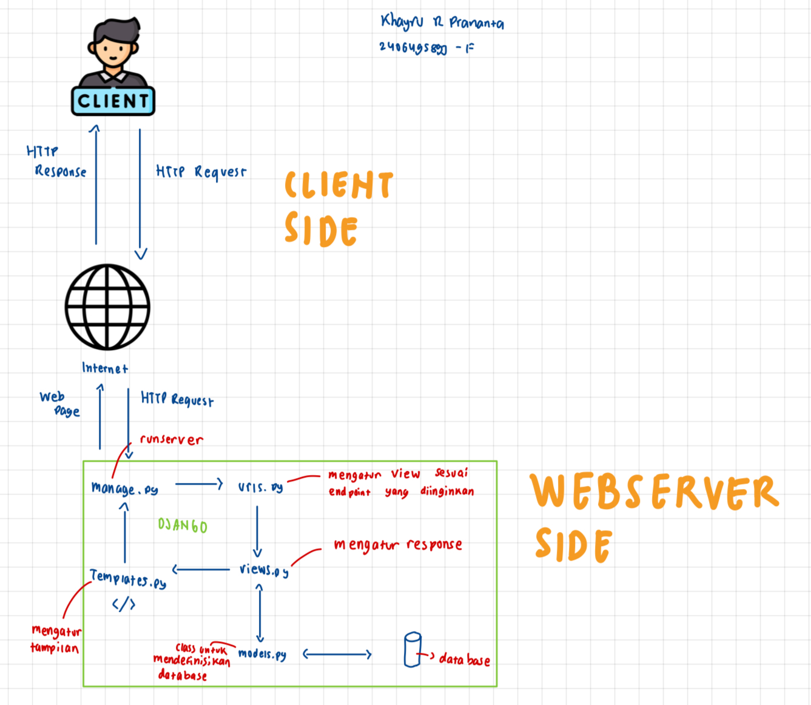

# lilywhite-store
Nama: Khayru Rafamanda Prananta
Kelas: PBP F
NPM: 2406495893

LANGKAH PENGERJAAN [Soal 1]

LANGKAH PERSIAPAN
1. Buat repositori baru di github dan clone di folder tugas 2 ini
2. Buat requirements.txt dan lakukan install dengan pip install -r requirements.txt buat proyek django dengan run 
"django-admin startproject [nama proyek] ." di terminal folder. Untuk proyek kali ini saya namakan lily_white
3. Buka file .env dan tambahkan konfigurasi PRODUCTION=False. buat file .env.prod dengan mengisi kredensial pribadi sesuai yang dikirim di email. 
4. Menambahkan allowed host -> ["localhost", "127.0.0.1"] di settings.py . Di file itu juga tambahkan "PRODUCTION = os.getenv('PRODUCTION', 'False').lower() == 'true'"
5. lanjut buat persiapan django

LANGKAH DJANGO
1. Activate virtual environment dengan run "source env/bin/activate"
2. run "python manage.py startapp main" di terminal untuk membuat aplikasi baru dengan nama main. kemudian di file setting.py, di INSTALLED_APPS tambahkan "main" di dalam kurung siku
3. lanjut buat view web

LANGKAH TEMPLATE
1. Buat folder baru yaitu templates dalam folder main. Kemudian di dalam templates buat main.html. Di main.html ini bertujuan untuk mengatur atau menuliskan apa yang ingin ditampilkan di web nanti. Bisa juga mengambil data dari views.py untuk ditampilkan dengan melakukan {{x_variable}}. Tambahkan juga heading tag<h> dan paragraph tag
 
2. Lanjut mengatur models.py

LANGKAH MODELS
1. Models.py bertujuan untuk mengatur dan mengelola data pada sebuah aplikasi. isinya akan menyesuaikan kebutuhan dari tema aplikasinya. 
Saya menggunakan    
    title -> CharField
    price -> IntegerField
    category -> CharField
    thumbnail -> URLField
    store_views -> PositiveIntegerField
    created_at -> DateTimeField
    is_featured -> BooleanField
2. Lanjut konfigurasi URL

LANGKAH KONFIGURASI URL
1. file urls.py bertujuan untuk semacam mengarahkan ke path tertentu. untuk defaultnya adalah '' yaitu sebagai homepage. path-path ini bisa di uji coba dengan local host

LANGKAH TESTING DI LOCAL HOST
1. Jalankan "python3 manage.py migrate" untuk migrasi, kemudian "python3 manage.py runserver" untuk jalankan server. 
2. Buka http://localhost:8000 untuk lihat localhost

LANGKAH GIT
1. Jika sudah selesai atau selesai merubah maka kita harus push ke git. diawal dengan run "git add ." di terminal
2. run "git commit-m'xxx'" untuk commit
3. run "git push origin master" untuk push ke github

LANGAK DEPLOY PWS
1. Setelah udah push ke GIT, lakukan deploy pws dengan run "git remote add pws <link pws>"
2. Kemudian run "git branch -M master"
3. git push pws master

Link PWS: https://khayru-rafamanda-storelilywhites.pbp.cs.ui.ac.id/

BAGAN CLIENT KE WEB [SOAL 2]
 
/Users/khayru/Downloads/UI-SI24/MATKUL/SMT3/PBP/Tugas2/lilywhite-store/BaganClientToWeb.jpeg

1. Client/Browser mengirim request
2. urls.py memeriksa URL dan meneruskannya ke fungsi di views.py
3. views.py menjalankan logika: jika perlu, ambil/ubah data lewat models.py
4. Hasil data akan dikirim ke template HTML untuk dirender kemudian ditampil
5. Response HTML dikirim kembali ke client/browser

PERAN SETTINGS.PY [SOAL 3]
Settings.py adalah pusat pengaturan untuk proyek Django. Setiap kali Django dijalankan, semua komponen (database, apps, template, dan lainnya) akan berpatokan pada konfigurasi di Settings.py. Dalam Django, settings.py memiliki berbagai pengaturan penting agar aplikasi dapat berjalan dengan baik. Seperti INSTALLED_APPS berisi daftar aplikasi yang digunakan dalam proyek, DATABASES menyimpan konfigurasi database, MIDDLEWARE mengatur proses tambahan pada request dan response, TEMPLATES mengatur engine template untuk merender HTML, ALLOWED_HOSTS berfungsi sebagai pengaman agar hanya host tertentu yang dapat mengakses aplikasi, dan STATICFILES mengatur lokasi serta pengelolaan file statis seperti CSS, JavaScript, dan gambar.

CARA KERJA MIGRASI [SOAL 4]
Migrasi di Django adalah cara untuk menjaga agar struktur database selalu sama dengan struktur model (models.py) yang kita buat
Jadi Saat kita menambah, menghapus, atau mengubah field di model, Django perlu mengetahui bahwa databasenya juga harus ikut berubah. Dengan perintah makemigrations, Django membuat file migrasi yang berisi sebagai instruksi perubahan. Lalu, perintah migrate akan mengeksekusi instruksi tersebut ke database

Menurut Anda, dari semua framework yang ada, mengapa framework Django dijadikan permulaan pembelajaran pengembangan perangkat lunak? [SOAL 5]
Menurut saya, Django sangat cocok buat awal belajar web development karena udah disediakan banyak hal yang siap pakai. Jadi tidak perlu ribet bikin login, database, atau admin dari nol. Django juga pakai Python yang mana sudah dipelajari di semester 1. Konsep MVT juga mudah dipahami untuk belajar alur web app. 

[FEEDBACK]
Kak Sayyid sudah sangat membantu proses pembelajaran di mata kuliah PBP ini. Saat saya kesulitan, kak Sayyid selalu siap memberikan bantuan dan menjamin saya kedepannya akan bisa mengerjakan tugas/tutorial secara mandiri.